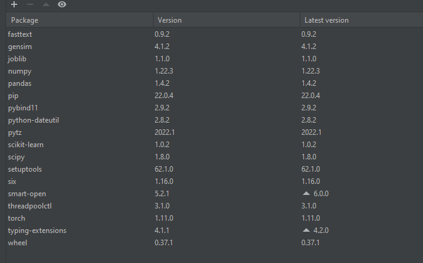

# CS598_FINAL_PROJECT - Chris Toombs (ctoombs2@illinois.edu)
_Deep Learning for Healthcare - Final Project - Classification of ICD-9 codes to Clinical text_

### Original Paper Citation

Vitor Pereira, Sérgio Matos, and José Luís Oliveira. 2018. Automated ICD9-CM medical coding of diabetic patient’s clinical reports. In International
Conference on Data Science, E-learning and Information Systems 2018 (DATA
’18), October 1–2, 2018, Madrid, Spain. ACM, New York, NY, USA, 6 pages.
https://doi.org/10.1145/3279996.3280019

###**CODE DEPENDENCIES:**

- Python 3.10 - [Download Python](https://www.python.org/)
- fastText version 0.9.2+
  - NOTE: I had issues downloading this from pipy/simple as we would normally do for our virtual environment. To be able
  to install, a manual installation was required - for my 64bit system, I included the .whl file for the correct install
  but you can find the correct whl for your system here [WHL for fastText](https://libraries.io/pypi/fasttext-wheel)
  - The command to install is : pip install whl_for_your_system
- numpy - version 1.22.3+
- scikit-learn 1.0.2
- pandas - version 1.4.2+
- torch - version 1.11.0+
- Packages in interpreter used for development at shown below:
  - 

###**SYSTEM REQUIREMENTS:**

This code ran successfully on a system with the following specifications:

- Model: HP Pavilion Laptop 15z-cw100
- Processor: AMD Ryzen 7 3700U w/Radeon Vega Mobile Gfx, 2300 mhz, 4core, 8LPU
- Memory: 12G Ram, 10G physical, 20G virtual

###**DATA ACCESS HOW TO:**

- Data can be downloaded from the MIMIC-III Website at: [Physionet](https://physionet.org/content/mimiciii/1.4/)
  - Use version 1.4 (in link above) - Access will need to be requested
  - Files needed:
    - D_ICD_DIAGNOSES.csv.gz
    - D_ICD_PROCEDURES.csv.gz
    - DIAGNOSES_ICD.csv.gz
      - Contains Diagnosis codes (ICD9) for patients from NOTEEVENTS.csv.gz
    - NOTEVENTS.csv.gz
      - Contains clinical notes for patients

###**DESCRIPTION OF PROJECT:**

- clean_data.py
  - Used for data processing of datasets from MIMIC-III
- train_models_BINARY_BOT.py
  - Used for training the fastText models, for rolled ICD9 codes, with a binary classifier in fastText
  - Also outputs performance at end
- train_models_MULTI_BOT.py
  - Used for training the fastText models, for rolled ICD9 codes, with a multi classifier in fastText
  - Also outputs performance at end
- train_common_rolled_MULTI_CNN.py
  - Used for training the CNN models using KERAS, for just the common rolled codes
- fasttext-0.9.2-cp310-cp310-win_amd64.whl
  - Some users may encounter issues when trying to install fastText (used for binary classification) to their local environments. This whl file can be used to manually install fastText to your venv
    - Command: **pip install fasttext-0.9.2-cp310-cp310-win_amd64.whl**

###**HOW TO RUN**
    1. CLEAN Data
        - Run clean_data.py from venv, or from terminal with "python clean_data.py"
        - You will see cleansed data within the cleansed_data directory

    2. TRAIN Model for BAG OF TRICKS (NOT NEEDED UNLESS YOU WANT TO RETRAIN!)
        - To retrain, run train_common_rolled_BINARY_BOT.py/train_common_rolled_MULTI_BOT from venv,
          or from terminal with "python <sript_name>"
            - Model for rolled ICD codes (binary classifier) is saved at ./models/model_rolled_common_BINARY_BOT.bin
            - Model for rolled ICD codes (multi classifier) is saved at ./models/model_rolled_common_MULTI_BOT.bin

    3. TRAIN Model for CNN (NOT NEEDED UNLESS YOU WANT TO RETRAIN!)
        - To retrain, run train_common_rolled_BINARY_CNN.py from venv, or from terminal with "python train_common_rolled_MULTI_CNN.py"
        - There is no model saved, this is done within memory in the script itself

    NOTE -- All Training scripts will output the result at the end, assuming you have downloaded the text
    as well run the clean script

###**TABLE OF RESULTS**

BINARY BOT (Observed in Code):
- Time to run: 4m30s
- Precision: .807462
- Recall: .172760

BINARY MULTI (Observed in Code):
- Time to run: 2m30s
- Precision: .797761
- Recall: .170684

BINARY CNN (Observed in Code):
- ~40m (1.5m per epoch @ 20 epochs)
- Precision: .701906
- Recall: .609022